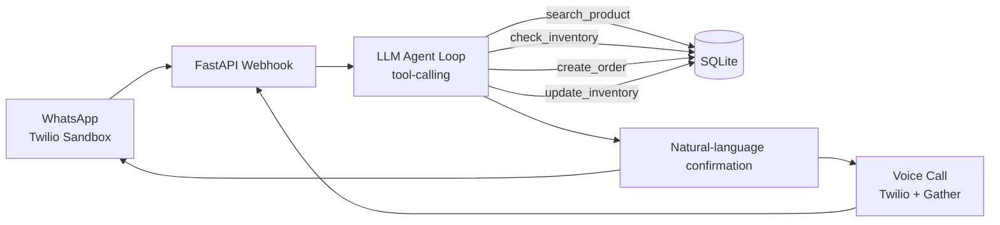

# 🏪 Zero-Click Store Operator

**Track 1 — Autonomous AI & Agentic Workflows**
Persona: Neighborhood Kirana & General Store Merchant

An autonomous AI agent that takes a customer's natural-language order — over WhatsApp, voice call, or (later) walk-in — and independently understands intent, checks live inventory, calculates pricing, places the order, updates stock, and confirms with the customer. No human in the loop for the happy path.

---

## 1. The Problem

Kirana store owners get orders through WhatsApp, phone calls, and walk-ins, in a natural mix of Hindi and English ("Hinglish"). Today, the owner has to manually:
- Read/listen to the request
- Check what's in stock
- Calculate the price
- Write down the order
- Confirm delivery

This doesn't scale — especially when multiple customers message at once. **Zero-Click Store Operator** removes the owner from that loop entirely.

**Example input:**
> "Bhaiya, 2 packets Aashirvaad atta, 1 Fortune oil and 3 Maggi bhej do. Ghar pe deliver kar dena."

---

## 2. The Key Question Judges Will Ask

> *"Is this actually an autonomous operator, or just a chatbot?"*

Our answer: the LLM is never just generating a reply — it is **calling tools that mutate real backend state** (inventory, orders table). That's the line between a chatbot and an agent, and it's the design principle behind every decision below.

---

## 3. Required Autonomous Agent Loop

| # | Step | Implementation |
|---|------|-----------------|
| 1 | Understand customer intent | LLM system prompt + conversation context |
| 2 | Identify requested products | LLM → `search_product` tool call |
| 3 | Check inventory/pricing from DB | LLM → `check_inventory` tool call |
| 4 | Calculate order total | LLM (reasoning) or `calculate_total` tool |
| 5 | Create the order | LLM → `create_order` tool call |
| 6 | Update inventory | LLM → `update_inventory` tool call |
| 7 | Confirm to customer | LLM final natural-language response |

Steps 2, 3, 5, 6 are the **"at least 2 backend actions"** scoring requirement — we clear that with room to spare, and each is a distinct, auditable tool call (good for demoing to judges that this isn't scripted).

---

## 4. Tech Stack

| Layer | Choice | Why |
|---|---|---|
| **Backend** | Python + FastAPI | Async-friendly for webhooks, auto-generated docs (`/docs`) useful for live demo, minimal boilerplate |
| **Database** | SQLite | Zero setup — no server, no connection strings. A single `store.db` file. Real SQL, fits the 4-hr window |
| **Agent brain** | Claude / GPT-4o with function/tool calling | Handles Hinglish natively — no separate NLU or translation layer needed. Model decides *which tool to call*, which is what makes this "autonomous" rather than a rules-based chatbot |
| **WhatsApp channel** | Twilio WhatsApp Sandbox | Meta's Cloud API needs business verification — dead on arrival in 4 hours. Twilio sandbox gives a working number in ~5 minutes via a join code |
| **Voice channel** | Twilio Voice + `<Gather input="speech">` | Twilio handles STT/TTS for you server-side (no separate Whisper pipeline needed). `<Say>` speaks the LLM's response back |
| **Tunneling** | ngrok | Exposes local FastAPI server to Twilio's webhooks during dev/demo |
| **Language handling** | Prompt engineering only | No translation service — instruct the model to mirror the customer's Hindi/English mix in its reply |

> **Improvement over the original plan:** rather than one AI call to parse intent and a *second, separate* AI call to query the DB (as sketched), we collapse this into **one agent loop with tool-calling**. Fewer moving parts, fewer round-trip failures, and it directly demonstrates autonomy to judges instead of looking like chained API calls.

---

## 5. Architecture



---

## 6. Database Schema (SQLite)

```sql
CREATE TABLE products (
    id INTEGER PRIMARY KEY,
    name TEXT NOT NULL,
    price REAL NOT NULL,
    stock INTEGER NOT NULL,
    low_stock_threshold INTEGER DEFAULT 5
);

CREATE TABLE customers (
    id INTEGER PRIMARY KEY,
    phone TEXT UNIQUE,
    name TEXT,
    address TEXT
);

CREATE TABLE orders (
    id INTEGER PRIMARY KEY,
    customer_id INTEGER,
    total REAL,
    status TEXT DEFAULT 'confirmed',
    created_at TIMESTAMP DEFAULT CURRENT_TIMESTAMP,
    FOREIGN KEY (customer_id) REFERENCES customers(id)
);

CREATE TABLE order_items (
    id INTEGER PRIMARY KEY,
    order_id INTEGER,
    product_id INTEGER,
    quantity INTEGER,
    unit_price REAL,
    FOREIGN KEY (order_id) REFERENCES orders(id),
    FOREIGN KEY (product_id) REFERENCES products(id)
);
```

---

## 7. Agent Tools (Function-Calling Contract)

```
search_product(query: str) -> list[Product]
check_inventory(product_id: int) -> {stock, price}
create_order(customer_phone: str, items: list[{product_id, qty}]) -> order_id
update_inventory(product_id: int, qty_delta: int) -> new_stock
```

**Out-of-stock / alternates rule (bonus goal, made explicit):**
If `check_inventory` returns `stock < requested_qty`, the agent must:
1. Never silently drop the item.
2. Offer the nearest in-stock alternate product (or partial quantity) in its reply.
3. Only call `create_order` once the customer confirms the substitution — this is the one point in the loop where the "fully autonomous" flow should pause for confirmation, since silently substituting a product is worse UX than silently failing.

---

## 8. Setup

```bash
# 1. Clone & install
pip install fastapi uvicorn twilio anthropic python-dotenv

# 2. Init DB
python init_db.py   # creates store.db + seed products

# 3. Run server
uvicorn main:app --reload --port 8000

# 4. Expose locally
ngrok http 8000

# 5. Point Twilio WhatsApp Sandbox + Voice webhook to:
#    https://<ngrok-id>.ngrok.io/webhook/whatsapp
#    https://<ngrok-id>.ngrok.io/webhook/voice
```

Environment variables needed: `ANTHROPIC_API_KEY` (or `OPENAI_API_KEY`), `TWILIO_ACCOUNT_SID`, `TWILIO_AUTH_TOKEN`.

---

## 9. Scoring Alignment (25 pts — Core Functionality)

| Requirement | Points | Covered by |
|---|---|---|
| Understand customer request | 5 | Agent loop step 1–2 |
| Retrieve live inventory/pricing | 5 | `check_inventory` tool |
| Execute backend action | 5 | `create_order`, `update_inventory` |
| Create/update order | 5 | `create_order` |
| Correct confirmation | 5 | Final LLM reply, grounded in tool results (not hallucinated) |

## 10. Core MVP Checklist

- [ ] Natural-language customer interaction
- [ ] Intent/product understanding
- [ ] Live database/tool retrieval
- [ ] At least 2 backend actions
- [ ] Structured order creation
- [ ] Confirmation to the customer

## 11. Bonus / Stretch Goals (if time remains, in priority order)

1. Handling unavailable products & alternates *(build this — it's cheap and judge-visible)*
2. Multiple simultaneous customer orders (test with 2 WhatsApp threads in parallel)
3. Automatic low-stock alert (push a message to store owner's number when `stock < threshold`)
4. Customer history/memory (repeat-order shortcut: "same as last time")
5. Upselling & product recommendations
6. Human approval workflow for edge cases
7. Multi-language (already free via prompting — just needs a demo line in Marathi/Tamil etc. to show off)

---

## 12. Suggested 4-Hour Timeline

| Time | Task |
|---|---|
| 0:00 – 0:45 | SQLite schema + seed data, FastAPI skeleton |
| 0:45 – 1:45 | LLM agent loop with tool-calling (parse → check → total → order → update → confirm) |
| 1:45 – 2:30 | Twilio WhatsApp sandbox webhook wired end-to-end via ngrok |
| 2:30 – 3:15 | Edge cases: out-of-stock/alternates, multi-item orders (directly graded) |
| 3:15 – 4:00 | Buffer + one bonus goal (voice call, or low-stock alert) — stop building, start rehearsing the live demo |

**Demo tip:** since scoring is "ZERO SLIDES • 100% LIVE EXECUTION," rehearse the exact WhatsApp message you'll send live, and have a backup screen-recording in case of flaky wifi/ngrok during judging.
