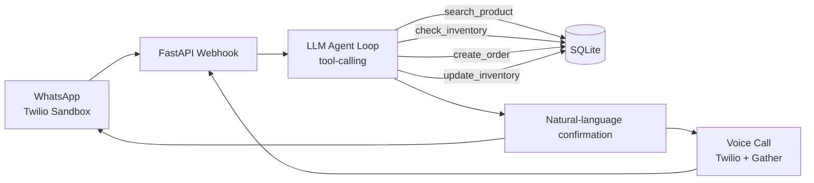

# 🏪 Zero-Click Store Operator

**An autonomous AI agent that runs a neighborhood kirana store's order pipeline end-to-end — no human clicks required.**

> Track 1 — Autonomous AI & Agentic Workflows
> Persona: Neighborhood Kirana & General Store Merchant

---

## Table of Contents

- [Overview](#overview)
- [The Problem](#the-problem)
- [Our Solution](#our-solution)
- [Architecture](#architecture)
- [Tech Stack](#tech-stack)
- [Agent Tools](#agent-tools-function-calling-contract)
- [Database Schema](#database-schema)
- [Setup & Installation](#setup--installation)
- [Demo Walkthrough](#demo-walkthrough)
- [Core MVP Checklist](#core-mvp-checklist)
- [Bonus Features](#bonus-features-implemented)
- [Scoring Alignment](#scoring-alignment)
- [Team](#team)
- [Future Roadmap](#future-roadmap)

---

## Overview

Small kirana store owners field customer orders through WhatsApp, phone calls, and walk-ins — usually in a natural mix of Hindi and English. Today, the owner manually reads every message, checks stock, does the math, writes down the order, and confirms delivery. It doesn't scale past one customer at a time.

**Zero-Click Store Operator** replaces that manual loop with an autonomous agent. The customer sends a message like:

> *"Bhaiya, 2 packets Aashirvaad atta, 1 Fortune oil and 3 Maggi bhej do. Ghar pe deliver kar dena."*

...and the agent independently understands the request, checks live inventory, calculates the total, places the order, updates stock, and replies with a confirmation — with zero manual intervention from the store owner.

---

## The Problem

- Orders arrive through **three unstructured channels**: WhatsApp, voice calls, and walk-ins
- Requests come in **natural, mixed-language Hinglish**, not structured commands
- Store owners must **manually cross-reference inventory and pricing** for every order
- **Multiple simultaneous customers** create delays and mistakes
- There is no system of record — orders and stock updates live in someone's memory or a notebook

---

## Our Solution

A single **LLM-driven agent loop** with tool-calling access to a live database, exposed over WhatsApp (and optionally voice), that completes the full order lifecycle autonomously:

| Step | Action | How |
|---|---|---|
| 1 | Understand customer intent | LLM reasoning over the raw message |
| 2 | Identify requested products | Tool call: `search_product` |
| 3 | Check inventory & pricing | Tool call: `check_inventory` |
| 4 | Calculate order total | LLM reasoning, grounded in tool results |
| 5 | Create the order | Tool call: `create_order` |
| 6 | Update inventory | Tool call: `update_inventory` |
| 7 | Confirm to the customer | LLM natural-language reply |

**Why this counts as "autonomous" and not "a chatbot":** the model doesn't just generate a reply — it decides which tools to call, and those tools mutate real backend state (new order rows, updated stock counts). Steps 3, 5, and 6 are backend actions, clearing the "at least 2 backend actions" requirement with margin.

---

## Architecture



---

## Tech Stack

| Layer | Choice | Why |
|---|---|---|
| **Backend** | Python + FastAPI | Async-friendly for webhooks, auto docs, minimal boilerplate |
| **Database** | SQLite | Zero setup, real SQL, fits a short build window |
| **Agent brain** | Claude (Anthropic) with tool/function calling | Handles Hinglish natively; model chooses which backend action to invoke |
| **WhatsApp channel** | Twilio WhatsApp Sandbox | Live number in minutes — no business verification needed |
| **Voice channel** | Twilio Voice + `<Gather input="speech">` | Built-in STT/TTS — no separate speech pipeline |
| **Tunneling** | ngrok | Exposes local FastAPI server to Twilio webhooks |
| **Language handling** | Prompt engineering | Model mirrors customer's language mix — no translation service needed |

---

## Agent Tools (Function-Calling Contract)

```
search_product(query: str) -> list[Product]
check_inventory(product_id: int) -> { stock, price }
create_order(customer_phone: str, items: list[{product_id, qty}]) -> order_id
update_inventory(product_id: int, qty_delta: int) -> new_stock
```

**Read-only tools** (`search_product`, `check_inventory`) don't count as backend actions.
**State-changing tools** (`create_order`, `update_inventory`) do — every completed order guarantees at least 2 real database writes.

**Out-of-stock handling:** if requested quantity exceeds available stock, the agent offers an in-stock alternate or partial quantity and waits for customer confirmation before calling `create_order` — the one deliberate pause in an otherwise zero-click flow.

---

## Database Schema

```sql
CREATE TABLE products (
    id INTEGER PRIMARY KEY,
    name TEXT NOT NULL,
    price REAL NOT NULL,
    stock INTEGER NOT NULL,
    low_stock_threshold INTEGER DEFAULT 5
);

CREATE TABLE customers (
    id INTEGER PRIMARY KEY,
    phone TEXT UNIQUE,
    name TEXT,
    address TEXT
);

CREATE TABLE orders (
    id INTEGER PRIMARY KEY,
    customer_id INTEGER,
    total REAL,
    status TEXT DEFAULT 'confirmed',
    created_at TIMESTAMP DEFAULT CURRENT_TIMESTAMP,
    FOREIGN KEY (customer_id) REFERENCES customers(id)
);

CREATE TABLE order_items (
    id INTEGER PRIMARY KEY,
    order_id INTEGER,
    product_id INTEGER,
    quantity INTEGER,
    unit_price REAL,
    FOREIGN KEY (order_id) REFERENCES orders(id),
    FOREIGN KEY (product_id) REFERENCES products(id)
);
```

---

## Setup & Installation

```bash
# 1. Clone the repo
git clone <repo-url>
cd zero-click-store-operator

# 2. Install dependencies
pip install -r requirements.txt

# 3. Set environment variables
cp .env.example .env
# fill in: ANTHROPIC_API_KEY, TWILIO_ACCOUNT_SID, TWILIO_AUTH_TOKEN

# 4. Initialize the database
python init_db.py          # creates store.db + seeds sample products

# 5. Run the server
uvicorn main:app --reload --port 8000

# 6. Expose it publicly
ngrok http 8000

# 7. Point Twilio webhooks to:
#    https://<ngrok-id>.ngrok.io/webhook/whatsapp
#    https://<ngrok-id>.ngrok.io/webhook/voice
```

---

## Demo Walkthrough

1. Customer sends a WhatsApp message: *"Bhaiya, 2 packets Aashirvaad atta, 1 Fortune oil bhej do"*
2. Agent identifies both products and checks live stock
3. Agent calculates the total and creates the order
4. Agent updates inventory counts in real time
5. Agent replies with a confirmation, including total and expected delivery
6. **Edge case shown live:** ordering an out-of-stock item → agent offers an alternate → customer confirms → order proceeds

---

## Core MVP Checklist

- [x] Natural-language customer interaction
- [x] Intent/product understanding
- [x] Live database/tool retrieval
- [x] At least 2 backend actions (`create_order`, `update_inventory`)
- [x] Structured order creation
- [x] Confirmation to the customer

## Bonus Features Implemented

- [x] Handling unavailable products & alternates
- [ ] Multiple simultaneous customer orders
- [ ] Automatic low-stock alert
- [ ] Customer history/memory
- [ ] Upselling & product recommendations
- [ ] Human approval workflow for edge cases
- [ ] WhatsApp Cloud API (production-grade, vs. sandbox)

*(Update checkboxes to reflect what actually shipped before final submission.)*

---

## Scoring Alignment

| Requirement | Points | Covered By |
|---|---|---|
| Understand customer request | 5 | Agent intent parsing |
| Retrieve live inventory/pricing | 5 | `check_inventory` |
| Execute backend action | 5 | `create_order`, `update_inventory` |
| Create/update order | 5 | `create_order` |
| Correct confirmation | 5 | LLM reply grounded in tool output |
| **Total** | **25** | |

---

## Team

| Name | Role |
|---|---|
| Member A | Backend & Database — FastAPI, SQLite schema, agent tools |
| Member B | WhatsApp Channel & Integration — Twilio, webhook wiring |
| Member C | Voice Channel & Demo — Twilio Voice, demo script, testing |

---

## Future Roadmap

- Migrate from Twilio WhatsApp Sandbox to Meta's WhatsApp Cloud API for production use
- Replace SQLite with Postgres for multi-store, concurrent-write scale
- Add a store-owner dashboard for order history and manual overrides
- Extend the agent with proactive reordering suggestions based on sales velocity
