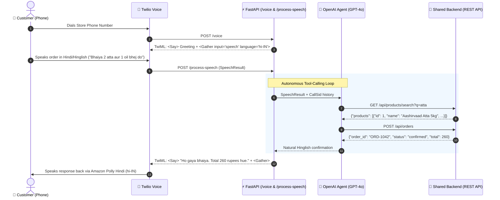

# 📞 Zero-Click Store Operator — Phone Call Voice Module

> **Hackathon Role**: Dedicated Phone Voice Channel microservice for the "Zero-Click Store Operator".  
> Handles natural customer voice orders over Twilio Voice in **Hindi, English, and Hinglish**, interacts autonomously with the shared backend REST API, and provides instant conversational confirmations.

---

## 1. Flow & Architecture



---

## 2. Project Structure

```
phonecall/
├── main.py             # FastAPI server with /voice, /process-speech, /test-call
├── agent.py            # OpenAI tool-calling agent with voice prompt & clean formatting
├── tools.py            # Async REST client calling shared backend via httpx
├── phone_session.py    # Conversation state manager per Twilio CallSid
├── config.py           # Environment and voice configuration loader
├── requirements.txt    # Python dependencies
├── .env.example        # Environment variables template
├── .gitignore          # Git ignore rules
├── README.md           # Setup and developer documentation
└── tests/
    └── test_phonecall.py # Unit and integration test suite
```

---

## 3. Quick Start (4-Hour Hackathon Setup)

### 1. Install Dependencies
```bash
pip install -r phonecall/requirements.txt
```

### 2. Configure Environment Variables
Copy `.env.example` to `.env`:
```bash
cp phonecall/.env.example phonecall/.env
```

Key environment settings:
```ini
# Team's Shared Backend REST API URL
BACKEND_URL=http://localhost:8000

# OpenAI API Key (leave blank or set ENABLE_LLM_AGENT=false for Step 1 echo testing)
OPENAI_API_KEY=sk-...
OPENAI_MODEL=gpt-4o-mini
ENABLE_LLM_AGENT=true

# Twilio Voice Settings
TWILIO_VOICE_LANGUAGE=hi-IN
TWILIO_VOICE_NAME=Polly.Aditi
```

### 3. Run the Server
```bash
# Run directly with uvicorn
uvicorn phonecall.main:app --host 0.0.0.0 --port 8000 --reload
```

Health check is available at:
```
http://localhost:8000/
```

---

## 4. Two-Step Execution & Testing

### Step 1: Basic Twilio Voice Flow (Without LLM)
To test Twilio STT and voice synthesis immediately without consuming OpenAI tokens or waiting for backend APIs:
1. In `.env`, set:
   ```ini
   ENABLE_LLM_AGENT=false
   ```
2. The server will execute the baseline loop:
   - Greets caller in Hindi.
   - Twilio `<Gather>` transcribes caller speech.
   - Server logs transcribed text in console:
     ```
     ==================================================
     [BASIC TWILIO VOICE FLOW - NO LLM]
     CallSid:    CA123456789
     Caller:     +919876543210
     Transcript: 'bhaiya do packet maggi dena'
     ==================================================
     ```
   - Twilio speaks back: `"Aapne kaha: bhaiya do packet maggi dena"` and opens another `<Gather>`.

### Step 2: Full OpenAI Agent Integration (With Backend REST Tools)
1. In `.env`, set:
   ```ini
   ENABLE_LLM_AGENT=true
   OPENAI_API_KEY=your-key-here
   ```
2. The agent interprets Hinglish phrases (e.g. *"bhaiya do packet Maggi aur ek Parle-G dena"*), searches the backend for products, checks stock, creates orders via `httpx`, and generates punchy voice confirmations.

---

## 5. Team Backend REST API Contract

The phone module interacts strictly through these REST endpoints:

### 1. Search Products
```http
GET {BACKEND_URL}/api/products/search?q=atta
```
**Expected Response:**
```json
{
  "products": [
    {
      "id": 123,
      "name": "Aashirvaad Atta 1kg",
      "price": 55,
      "stock": 20
    }
  ]
}
```

### 2. Check Inventory by ID
```http
GET {BACKEND_URL}/api/products/123
```
**Expected Response:**
```json
{
  "id": 123,
  "name": "Aashirvaad Atta 1kg",
  "price": 55,
  "stock": 20
}
```

### 3. Create Confirmed Order
```http
POST {BACKEND_URL}/api/orders
Content-Type: application/json

{
  "customer_phone": "+919876543210",
  "source": "phone",
  "items": [
    {
      "product_id": 123,
      "quantity": 2
    }
  ]
}
```
**Expected Response:**
```json
{
  "order_id": "ORD-1042",
  "status": "confirmed",
  "total": 110,
  "items": [...]
}
```

> [!IMPORTANT]
> The backend handles inventory deduction and order insertion atomically. The phone module never touches the database directly.

---

## 6. Twilio & ngrok Setup

1. **Start ngrok tunnel**:
   ```bash
   ngrok http 8000
   ```
   Copy the HTTPS forwarding URL (e.g. `https://xyz123.ngrok-free.app`).

2. **Configure Twilio Phone Number**:
   - Go to [Twilio Console](https://console.twilio.com/) $\rightarrow$ **Phone Numbers** $\rightarrow$ **Active Numbers**.
   - Under **Voice Configuration**:
     - **A CALL COMES IN**: Select `Webhook`.
     - **URL**: `https://xyz123.ngrok-free.app/voice` (HTTP POST).
     - **CALL STATUS CHANGES**: `https://xyz123.ngrok-free.app/call-status` (HTTP POST).
   - Click **Save**.

3. **Make a Live Phone Call**:
   - Dial the Twilio number from your mobile phone.
   - Speak: *"Bhaiya, do packet atta aur ek oil bhej do."*

---

## 7. Developer Testing (Without Physical Phone Call)

You can simulate live customer phone turns using the developer endpoint `POST /test-call`:

```bash
curl -X POST http://localhost:8000/test-call \
  -H "Content-Type: application/json" \
  -d '{
    "call_sid": "DEV-TEST-01",
    "phone": "+919876543210",
    "speech": "bhaiya do packet maggi aur ek atta bhej do"
  }'
```

**Response:**
```json
{
  "call_sid": "DEV-TEST-01",
  "customer_phone": "+919876543210",
  "customer_speech": "bhaiya do packet maggi aur ek atta bhej do",
  "agent_spoken_reply": "Ho gaya bhaiya. Do packet Maggi aur ek packet Atta add kar diya hai. Total 288 rupees hue.",
  "llm_agent_enabled": true,
  "session_turns": 1
}
```

---

## 8. Running Automated Tests

Run the test suite:
```bash
python -m pytest phonecall/tests/test_phonecall.py -v
```
